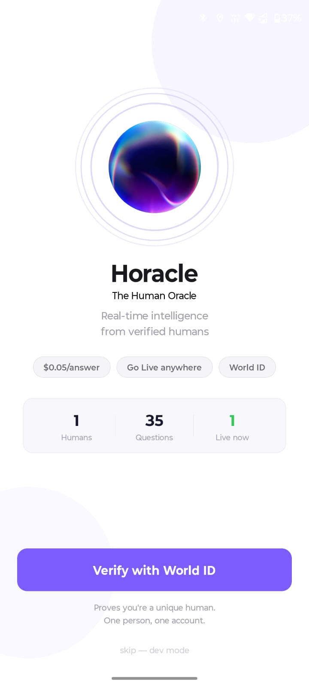
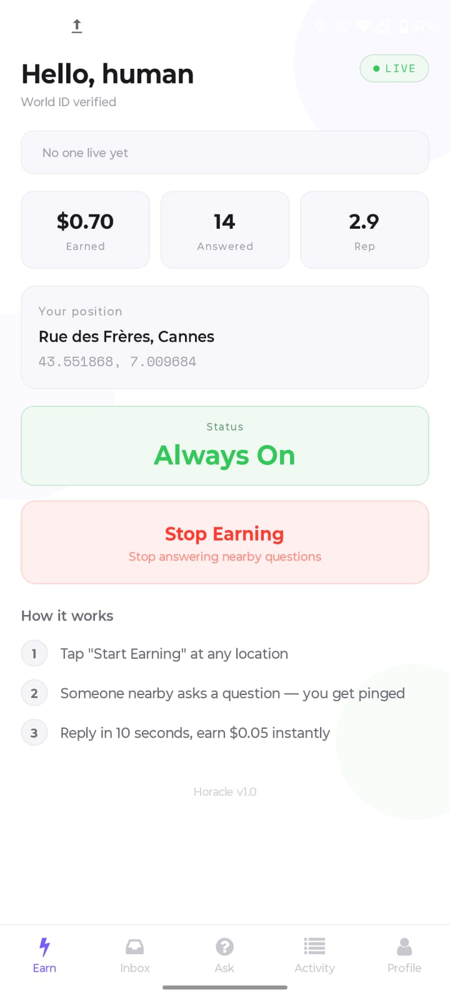
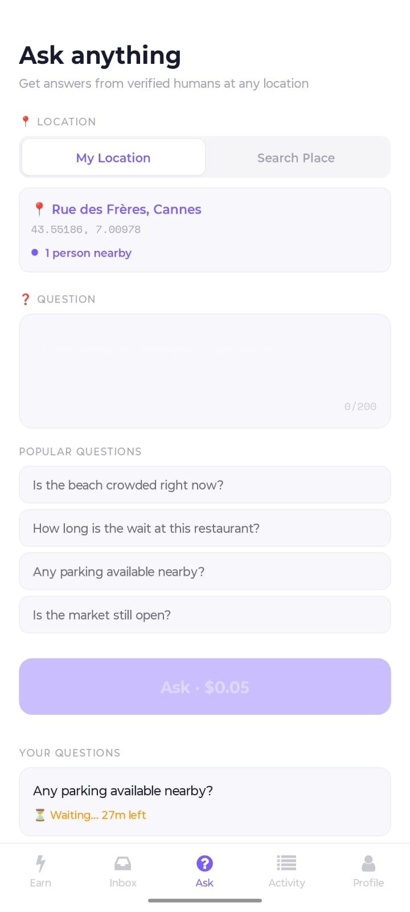
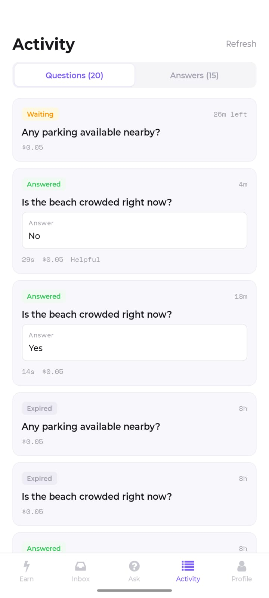
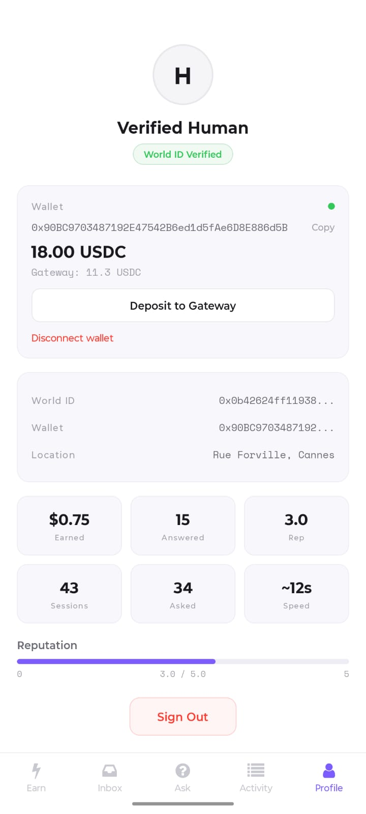
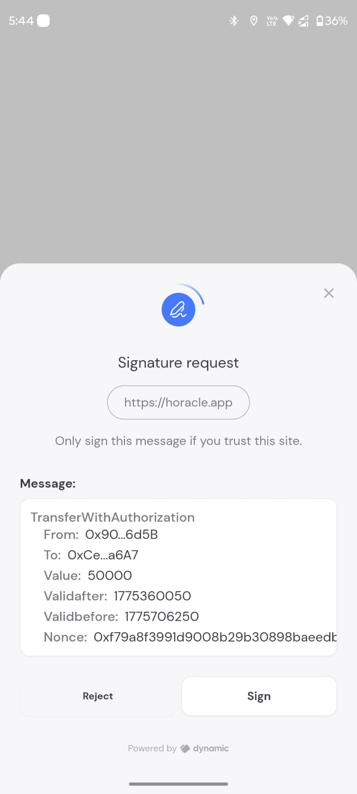

# Horacle — The Human Oracle

> The internet has data oracles. Blockchains have price oracles. **We built the human oracle.**

## Every human is an oracle.

Your eyes. Your location. Your knowledge. Right now, someone needs to know what's happening where you are. **Horacle lets them ask you — and pays you for answering.**

"Is the beach crowded?" — someone at the beach earns $0.05 for saying "Packed, come after 4pm."

"How long is the DMV line?" — someone in line earns $0.05 for saying "45 minutes."

"Did the food truck show up today?" — someone on that street earns $0.05 for saying "Yeah, it's here."

**Real humans. Real-time. Real answers. Real money.**

No AI hallucinations. No reviews from 6 months ago. No guessing. Just a verified human who's physically there, answering in 10 seconds.

---

## What is Horacle?

**Horacle = Human + Oracle.** A real-time intelligence marketplace where verified humans earn micropayments by answering questions about locations they're physically at.

### The Problem

No app answers **"what's happening at a place right now?"**

| Source | Problem |
|--------|---------|
| Google Reviews | 6 months old. "Great restaurant!" — but is there a table *right now*? |
| ChatGPT | Hallucinates. Can't know the chef left last month. |
| Calling the place | Most don't answer. "Is the parking lot full?" isn't something you call about. |
| Social media | Noise. No verified signal. |

### The Solution

**Make every human an oracle for their location.**

You're at the beach → You're the beach oracle.
You're in a queue → You're the queue oracle.
You're at a restaurant → You're the restaurant oracle.

Your phone knows where you are. World ID proves you're human. Circle pays you instantly. **You earn money from simply being somewhere.**

---

## How It Works

### You want to know something → Ask

```
1. Type: "Is the beach crowded right now?"
2. Pick location (GPS or search any place)
3. Horacle finds verified humans within 300m
4. Someone replies in ~10 seconds
5. You pay $0.05 (gasless, via Circle nanopayments)
```

### You want to earn → Go Live

```
1. Tap "Start Earning" at any location
2. Background tracking keeps you discoverable (even with app closed)
3. Phone buzzes: "Someone's asking about the beach — $0.05"
4. Reply in 10 seconds
5. $0.05 for 8 seconds = $22.50/hr equivalent
```

You're not doing extra work. You're already there. Dead time becomes money.

---

## Why World ID?

**Without proof of human, the system dies.** Bots would flood the network with fake answers to farm micropayments. One bot could claim to be at 1000 locations simultaneously.

World ID ensures:
- **One human = one oracle.** No sybil farming.
- **Real reputation.** Your rating is tied to a unique human, not a disposable account.
- **Trust.** When someone answers your question, you know a verified human said it.

**Horacle breaks without World ID.** It's not an add-on — it's the foundation.

## Why Circle Nanopayments?

$0.05 per answer is **impossible** with traditional payment rails. Stripe charges $0.30 per transaction. Credit card fees exceed the payment.

Circle's x402 nanopayments on World Chain make this viable:
- **Gasless** — users sign, Circle settles
- **$0.05 per query** — EIP-3009 `TransferWithAuthorization`
- **Batch settlement** — Circle handles on-chain execution
- **USDC** — stable, real money, not speculative tokens

## Why Dynamic?

Users need wallets but shouldn't think about wallets. Dynamic provides:
- **Embedded wallets** — created on sign-up, no MetaMask needed
- **EIP-712 signing** — user confirms payment with one tap
- **Gateway deposits** — USDC into Circle Gateway for nanopayments
- **Mobile-native** — React Native SDK, works in our Expo app

---

## Screenshots

<p align="center">
  
  
  
  
</p>
<p align="center">
  
  
  
</p>

---

## Tech Stack

| Layer | Tech | Purpose |
|-------|------|---------|
| Mobile App | React Native + Expo | Native app with background services |
| Identity | World ID 4.0 | Proof of unique human — the oracle must be real |
| Wallet | Dynamic SDK | Embedded wallets + EIP-712 signing |
| Payments | Circle x402 Nanopayments | Gasless $0.05 USDC on World Chain Sepolia |
| Location | expo-location | Background GPS every 15 seconds |
| Geospatial | Supabase + PostGIS | Find oracles within 300m via `ST_DWithin` |
| Push | Firebase + Expo Notifications | Alert nearby oracles instantly |
| Backend | Express + Node.js | x402-protected endpoints |

## Architecture

```
┌──────────────────────────────────────────────────┐
│            Expo React Native App                  │
│  ┌──────┐ ┌──────┐ ┌─────┐ ┌────────┐ ┌───────┐│
│  │ Earn │ │Inbox │ │ Ask │ │Activity│ │Profile││
│  └──────┘ └──────┘ └─────┘ └────────┘ └───────┘│
│  Background Location · Push Notifications        │
│  World ID (IDKit) · Dynamic Wallet · x402 Signer│
└───────────────────────┬──────────────────────────┘
                        │
          ┌─────────────┼─────────────┐
          ▼             ▼             ▼
   ┌────────────┐ ┌──────────┐ ┌──────────┐
   │ Supabase   │ │ Express  │ │ Circle   │
   │ + PostGIS  │ │ Backend  │ │ Gateway  │
   │            │ │ (x402)   │ │ (USDC)   │
   └────────────┘ └──────────┘ └──────────┘
```

## Key Flows

### Becoming an Oracle (World ID)
```
Open app → Verify with World ID (biometric, one-time)
  → Bridge protocol: AES-GCM encrypted session → deep link to World App
  → Proof verified via World's v4 API
  → One human, one oracle. Forever.
```

### Going Live (Background Location)
```
Tap "Start Earning" → GPS captured → live session created
  → expo-location tracks every 15 seconds (even when app is closed)
  → Android foreground service survives app kill
  → PostGIS indexes your position for instant discovery
  → You are now a discoverable oracle.
```

### Asking the Oracle (x402 Payment)
```
Type question + pick location
  → App calls x402-protected endpoint → gets 402
  → Dynamic wallet signs EIP-3009 authorization (gasless)
  → Retries with payment signature → Circle settles
  → PostGIS: SELECT oracles WHERE ST_DWithin(location, 300m)
  → Push notification to nearby oracles
  → First oracle answers → earns $0.05
  → Asker sees answer + rates it
```

### Daily Settlement (Batch Payouts)
```
Backend cron reads pending earnings from DB
  → Pool wallet deposits into Circle Gateway
  → GatewayClient.withdraw() to each oracle's wallet
  → Circle settles (gasless)
  → Oracles receive USDC
```

---

## Setup

### Prerequisites
- Node.js v20+
- Android phone with World App installed
- Expo account (for dev builds)

### Install
```bash
cd horacle
npm install

# Generate pool wallet for payments
npx tsx scripts/generate-wallets.ts
```

### Environment Variables

**App (`.env`):**
```
EXPO_PUBLIC_SUPABASE_URL=https://xxx.supabase.co
EXPO_PUBLIC_SUPABASE_ANON_KEY=eyJ...
EXPO_PUBLIC_APP_ID=app_xxx           # World Developer Portal
EXPO_PUBLIC_RP_ID=rp_xxx             # World ID 4.0
EXPO_PUBLIC_DYNAMIC_ENV_ID=xxx       # Dynamic dashboard
EXPO_PUBLIC_POOL_WALLET=0x...        # Pool wallet address
EXPO_PUBLIC_API_URL=http://IP:3001   # Backend URL
```

**Backend (`backend/.env`):**
```
POOL_PRIVATE_KEY=0x...               # Pool wallet private key
SUPABASE_URL=https://xxx.supabase.co
SUPABASE_SERVICE_KEY=eyJ...
PORT=3001
```

### Database
Run `scripts/setup-db.sql` in Supabase SQL Editor.

### Run
```bash
# Terminal 1 — Backend
cd backend && node index.js

# Terminal 2 — App
npx expo start --dev-client
```

### Build APK
```bash
eas build --profile development --platform android
```

---

## Bounty Eligibility

| Track | Prize | Why Horacle qualifies |
|-------|-------|----------------------|
| **World ID 4.0** | $8,000 | Every oracle is World ID verified. The system breaks without it — bots would farm payments with fake answers. Proof validated server-side via v4 API. World ID is the foundation, not a feature. |
| **Circle Nanopayments** | $6,000 | $0.05 per answer via x402 on World Chain Sepolia. EIP-3009 signed by user's Dynamic wallet. Circle Gateway settles. Gasless for all users. Without nanopayments, per-answer micropayments are economically impossible. |
| **Dynamic Mobile** | $1,667 | Embedded wallet in React Native. Auto-created on signup. EIP-712 signing for x402 payments. USDC deposits to Circle Gateway. The wallet layer that makes payments frictionless. |

**Total eligible: $15,667**

---

## Project Structure

```
horacle/
├── app/
│   ├── (auth)/verify.tsx      # World ID verification + wallet connection
│   ├── (tabs)/
│   │   ├── index.tsx          # Earn — Go Live, stats, location
│   │   ├── inbox.tsx          # Incoming questions to answer
│   │   ├── ask.tsx            # Ask questions with location search
│   │   ├── activity.tsx       # My Questions / My Answers
│   │   └── profile.tsx        # Wallet, balance, settings
│   ├── answer/[queryId].tsx   # Answer screen (from notification)
│   └── _layout.tsx            # Root layout, auth routing, Dynamic WebView
├── lib/
│   ├── worldid.ts             # World ID bridge protocol (AES-GCM, pure JS)
│   ├── dynamic.ts             # Dynamic wallet client
│   ├── payment.ts             # x402 payment signing + fallbacks
│   ├── queries.ts             # Question CRUD + push notifications
│   ├── location.ts            # GPS tracking + permissions
│   ├── geocode.ts             # Place search + reverse geocode (Photon API)
│   ├── auth.ts                # User auth persistence (SecureStore)
│   ├── supabase.ts            # Database client
│   └── wallet.ts              # Wallet management
├── tasks/
│   └── location-task.ts       # Background location → Supabase
├── backend/
│   ├── index.js               # Express + x402 middleware + push notifications
│   └── batch-settle.js        # Daily oracle payout cron
└── scripts/
    ├── setup-db.sql           # Full PostGIS schema + functions
    └── generate-wallets.ts    # Pool wallet generator
```

---

> *"The internet has data oracles. Blockchains have price oracles. We built the human oracle."*
>
> Every human knows something about where they are. Horacle turns that knowledge into real-time intelligence — verified, paid, and instant.

**Built at ETHGlobal Cannes 2026**
